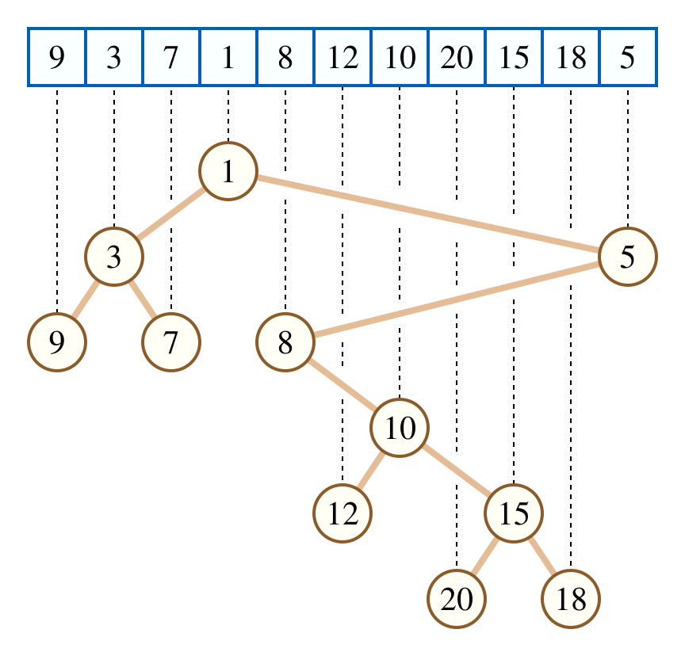
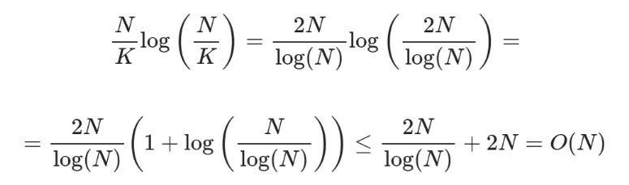
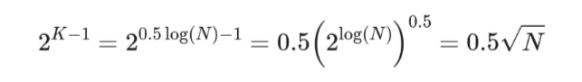

# Additional Algorithms

## Sparse Tables
Sparse Table is a data structure, that allows answering static range queries.  
The idea is to store for each range $[i:i + 2^j - 1]$, its result. This can be done efficiently using $O(n*log(n))$ memory and time precomputation.  
- Precompute: $O(n)$ for an $n$ length array.
- Query: $O(log(n))$ or $O(1)$ for [idempotent functions](https://en.wikipedia.org/wiki/Idempotence)

## Square Root Decomposition
Consider the problam of range updates and queries over an array of length $n$.  
Let us break the array into $`ceil(n/k)`$ blocks of length $k$ each.  
Maintain a range aggregate for each block.  
Doing so, allows us to performa an update/query in $O(n/k + k)$ time, going over block aggregates and a few extraneous elements to the right/left.  
Setting $k = n^{0.5}$, we can perform both, queries, and, updates in $O(n^{0.5})$ time.

## Cartesian Tree
A Cartesian tree is a binary tree that follows the min-heap property. The root is the minimum element and the left/right children are built recursively over the left/right subarrays split.  
It can be constructed in $O(n)$ time using stacks.  

  
   
  <em>Figure 1: An array and its Cartesian tree</em>

## Method of Four Russians
The Method of Four Russians is a technique for speeding up some algorithms over ranges. Particularly, when each cell may take on only a bounded number of possible values.  
- Break the problem of size *n* into subproblems of size *b*, plus some top-level problem of size *n / b*.
  - This is called a **macro/micro decomposition**.
- Solve all possible subproblems of size *b*.
- Solve the overall problem by combining solutions to the micro and macro problems.
- Think of it as **“divide, precompute, and conquer.”**  
Typically, $b = O(log(n))$. 

## Lowest Common Ancestor (LCA)
The lowest common ancestor problem involves efficiently finding the lowest common ancestor of any two nodes $v_1$ and $v_2$ in a tree, assuming no changes to the tree structure.  
Trivial algorithms can solve this in $O(n^2)$ time by solving for each pair and storing results.  
We shall look at other approaches of solving this efficiently.  
### Binary Lifting
Here, for each node, we store it's $2^j$ distance ancestor.  
Given that the $2^0$ ancestor is just the parent and the $2^{j+1}$ distance ancestor is the $2^j$ distance ancestor of the $2^j$ distance ancestor of the node, tranisitions are straightforward.  
This allows for $O(N*log(N))$ preprocessing for a tree with $N$ nodes.  
Further, each query can be answered in $O(log(N))$ time, as follows:
- Without loss of generality, let $height(v_1)$ = $u$ < $height(v_2)$ = $v$.
- Using at most $log(N)$ jumps, we can reach ancestor $v_2'$ from $v_2$, such that $height(v_2')$ = u.
- We then find the LCA of $v_1$ and $v_2'$, by finding the largest $2^j$ ancestor of each such that they differ, and repeat this until finially the parent of the two nodes found is common.  
- This node is the LCA.

### Farach-Colton and Bender
The algorithm borrows from the Method of Four Russians to break the [Eulerian tour](https://usaco.guide/gold/tree-euler?lang=cpp) of the tree array (of heights) into blocks.  
We divide the array  $A$  into blocks of size  $K = 0.5log(N)$. There are $ceil(N/K)$ blocks, for each block, store its aggregate, i.e., the minimum, and create a sparse table over these aggregates. The complexity to construct the sparse table is:  

 
<em>Figure 1: Sparse Table Complexity</em>

Minimum over blocks can be solved using the above sparse table.  
For minimum within blocks, we observe that the values in the array being heights computed using the Euler tour of the tree, only differ by 1, i.e., $+1$ or $-1$, let us represent these by $0$, $1$ respectively.  
Consider subtracting from each element of a block, its first element, this does not change the result of queries (index of minima) inside the block.  
Because the blocks are so small, there are only a handful of possible sequences,  

 
<em>Figure 2: Block Possibilities Count</em>

Thus, the number of different blocks is at most $O(N^{0.5})$, and therefore results of range minimum queries over them can be precomputed in $O(N^{0.5}*K^2)$ = $O(N^{0.5}*log^2(N))$ = $O(N)$ time. Mapping between blocks and results can be stored in an array $block[bitmask][left][right]$, storing the results of the block over its subarray $[left,right]$.

 

**Note:**  
An interesting implication of the above is a different method for the static range-minium-query (RMQ) problem.  
By constructing a cartesian tree on the input array (of length $n$), we can solve the RMQ problem with $O(n)$ precomputation and $O(1)$ time per query.  
Query resolution is equivalent here to finding the LCA over a range.

## References
1. [Sparse Table, CP-Algorithms](https://cp-algorithms.com/data_structures/sparse-table.html)
2. [CS166-0, Wayback Machine](https://web.archive.org/web/20230812194808/http://web.stanford.edu/class/cs166/lectures/00/Small00.pdf)
3. [CS166-1, Wayback Machine](https://web.archive.org/web/20240422013245/https://web.stanford.edu/class/cs166/lectures/01/Small01.pdf)
4. [Method of Four Russians, Wikipedia](https://en.wikipedia.org/wiki/Method_of_Four_Russians)
5. [Sqrt Decomposition, CP-Algorithms](https://cp-algorithms.com/data_structures/sqrt_decomposition.html)
6. [LCA - Binary Lifting](https://cp-algorithms.com/graph/lca_binary_lifting.html)
7. [LCA - Farach-Colton and Bender - CP-Algorithms](https://cp-algorithms.com/graph/lca_farachcoltonbender.html)
8. [LCA - Range Minimum Query, CP-Algorithms](https://cp-algorithms.com/graph/rmq_linear.html)