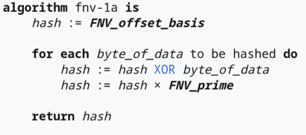

# Hashing
Hashing is often considered to be a magical domain that allows a great degree of optimization in practice.  
While there exist a bunch of hashing algorithms, it is oftentimes difficult to reason about the quality of the hasher.  
Certain analytical techniques allow us to study various characteristics such as pairwise/k-wise independence of inputs.  
Here, we focus instead on the avalanche test, a property that postulates that a hash function is typically considered good if for a single bit change in the input, half the bits in the output change.  

## Algorithms Considered
- Polynomial Rolling Hash
    - Consider a string, $s$, its hash is constructed as follows:
    - $h_s = 0$, $p = 31$, $m = 1e9 + 9$
    - for $i$ in $[0..s.len]$:  
        - $h_s$ = $(h_s$ + $ascii(s[i])$ * $p^{i})$ % $m$

- std::hash (FNV-1a)
    

        
         
        <em>Figure 1: FNV-1a Algorithm (Wikipedia)</em>
    

- XOR Hash
    - A simple hash function where the hash is the bitwise xor of all 32 bit disjoint components. (A string is broken into 4 character sets).
- Random-Hash
    - A simple hash function where the hash is a random hash chosen from a family of hashes where each hash function is represented by a distinct mask of 32 bits (corresponding to selection of bits from input).
    - The mask is applied to the input and the bin is chosen mod $m$.

## Results
For results, refer the benchmark [docs](bench/README.md)

## References
- [Avalanche Effect](https://en.wikipedia.org/wiki/Avalanche_effect)
- [Polynomial Rolling Hash](https://cp-algorithms.com/string/rabin-karp.html)
- [FNV Hash](https://en.wikipedia.org/wiki/Fowler%E2%80%93Noll%E2%80%93Vo_hash_function)
- [Universal/Random-Hash](https://en.wikipedia.org/wiki/Universal_hashing)