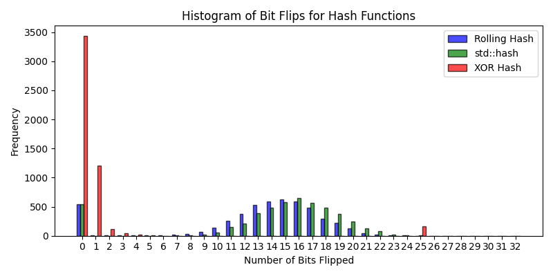
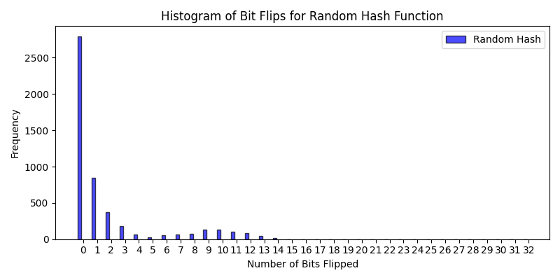

# Results

Each algorithm is tested against 5,000 randomly generated alphabetical strings of length 256, where one random index has one bit flipped.  
For the random-hash we generate 5,000 randomly generated 32 bit unsigned integers and compute the average number of bits flipped on hashing.  

---

| **Algorithm** | **Average Bits Flipped** |
|---------------|--------------------------|
| Rolling Hash  |           13.13          |
| std::hash     |           14.30          |
| XOR hash      |           0.99           |
| Random-Hash   |           1.90           |

  
   
  <em>Figure 1: No. of bits flipped on average by different hashing algorithms</em>

It is observed that among the given implementations, the std::hash performs best, with the rolling hash coming close.  
The nature of XOR hash and Random hash lead to poor performance on the avalanche test.  
XOR hash performs poorly particularly because for the given algorithm, one bit flip in the input, implies one bit flip in the output.  

  
   
  <em>Figure 2: No. of bits flipped on average by the random-hash algorithm</em>

Random-Hash performs poorly as flipping a bit only affects the output if that bit is among the chosen bits for the hasher (each bit chosen w.p. 50%).  
Additionally, this difference is amplified slightly by the distribution over modulo *m* (*m=999983*).