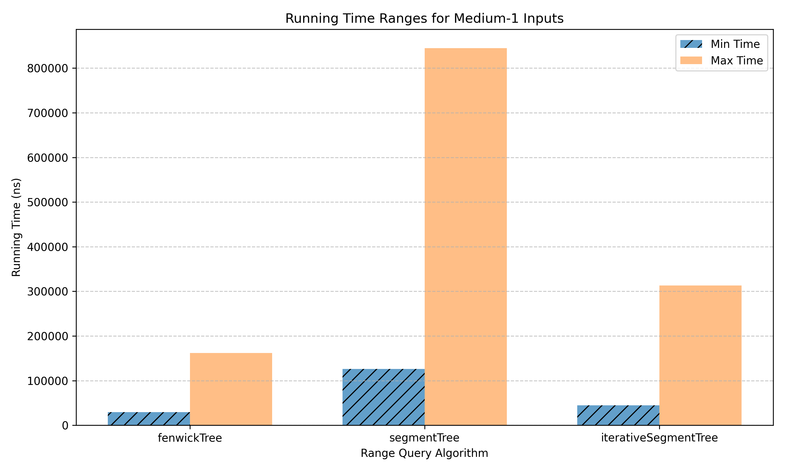

# Results

Each size below is tested with 10 test instances per algorithm.  
**Array length, query count for test categories:**

- **Small-1** 10-100, 10-100
- **Small-2** 10-100, 100-1,000
- **Medium-1:** 1,000-10,000, 1,000-10,000
- **Medium-2:** 1,000-10,000, 10,000-100,000
- **Large:** 100,000-1,000,000, 100,000-1,000,000  
Queries are split evenly among update/sum queries.

## Range Queries' Results
Least and highest running times across all tests.  
|           | **fenwickTree**         | **segmentTree**         | **iterativeSegmentTree**|
|-----------|-------------------------|-------------------------|-------------------------|
| small-1   | (1,255, 3,454)          | (3,853, 10,065)         | (1,205, 4,383)          |
| small-2   | (2,357, 16,172)         | (6,359, 49,646)         | (3,123, 21,445)         |
| medium-1  | (29,236, 161,666)       | (126,403, 844,780)      | (44,588, 313,366)       |
| medium-2  | (430,298, 1,735,205)    | (2,341,528, 10,133,545) | (843,497, 3,598,143)    |
| large     | (8,258,384, 25,595,156) |(38,811,311, 173,135,398)| (11,716,570, 54,932,104)|

  

    
     
    <em>Figure 1: Least and highest execution time on small inputs with few queries</em>
  

  

    
     
    <em>Figure 2: Least and highest execution time on small inputs with many queries</em>
  

  
   
  <em>Figure 3: Least and highest execution time on medium inputs with few queries</em>

  
   
  <em>Figure 4: Least and highest execution time on medium inputs with many queries</em>

  
   
  <em>Figure 5: Least and highest execution time on large inputs</em>

It is observed that across array sizes and query counts, fenwick trees typically perform best among the three, with the iterative version of segment tree following it closely, and the recursive segment tree lagging behind.  
In practice, the versatility of segment trees brings them to use above fenwick trees. For instance, even to handle range minimum queries, the standard fenwick trees fail, and we must use two in conjunction.

## References
[Fenwick Tree - Range Minimum Queries](https://ioinformatics.org/journal/v9_2015_39_44.pdf)