# Project Report
**Prepared by: Warul Kumar Sinha (2023201045)**  
**Under the advisory of: Dr. Kshitij Gajjar**

A variety of algorithms exist to solve the same problem, but nuances often affect practical applicability. This project aims to analyse, benchmark, compare, and document algorithms alongside such nuances.  
Information on benchmarking, optimizations and references can be found under [docs](#docs).  

## Algorithms

### [Hashing](#hashing-1)
- Avalanche Test
    - Polynomial Hash
    - std::hash (FNV-1a)

### [Range-Queries](#range-queries-1)
- Fenwick Trees
- Segment Trees
- Sparse Tables

### [Sorting](#sorting-1)
- Insertion Sort
- Hybrid Sort
- Mergesort
- Quicksort

### [Strings](#strings-1)
- KMP
- Manacher
- Rabin Karp
- Z-Function

### [Additional-Algorithms](#additional-algorithms-1)
- Cartesian Trees
- Square Root Decomposition
- Method of Four Russians
- Lowest Common Ancestor
    - Binary Lifting
    - Farach-Colton and Bender

## System Information
Processor: Intel(R) Core(TM) Ultra 9 185H
Operating System: Linux 6.14.5  
Language Versions: C++ 23 (gcc 15.1.1), Python 3.13.3, Bash (5.2.37)  

<hr style="height:4px; background-color:black; border:none;" />

# [Hashing](#hashing)
Hashing is often considered to be a magical domain that allows a great degree of optimization in practice.  
While there exist a bunch of hashing algorithms, it is oftentimes difficult to reason about the quality of the hasher.  
Certain analytical techniques allow us to study various characteristics such as pairwise/k-wise independence of inputs.  
Here, we focus instead on the avalanche test, a property that postulates that a hash function is typically considered good if for a single bit change in the input, half the bits in the output change.  

## Algorithms Considered
- Polynomial Rolling Hash
    - Consider a string, $s$, its hash is constructed as follows:
    - $h_s = 0$, $p = 31$, $m = 1e9 + 9$
    - for $i$ in $[0..s.len]$:  
        - $h_s$ = $(h_s$ + $ascii(s[i])$ * $p^{i})$ % $m$

- std::hash (FNV-1a)
```pseudocode
algorithm fnv-1a is
    hash := FNV_offset_basis

    for each byte_of_data to be hashed do
        hash := hash XOR byte_of_data
        hash := hash × FNV_prime

    return hash
```
- XOR Hash
    - A simple hash function where the hash is the bitwise xor of all 32 bit disjoint components. (A string is broken into 4 character sets).
- Random-Hash
    - A simple hash function where the hash is a random hash chosen from a family of hashes where each hash function is represented by a distinct mask of 32 bits (corresponding to selection of bits from input).
    - The mask is applied to the input and the bin is chosen mod $m$.

## Results
Refer [benchmarks](#hashing-benchmarks)

[report <-](#project-report)
<hr style="height:4px; background-color:black; border:none;" />

# [Hashing Benchmarks](#results)

Each algorithm is tested against 5,000 randomly generated alphabetical strings of length 256, where one random index has one bit flipped.  
For the random-hash we generate 5,000 randomly generated 32 bit unsigned integers and compute the average number of bits flipped on hashing.  

---

| **Algorithm** | **Average Bits Flipped** |
|---------------|--------------------------|
| Rolling Hash  |           13.13          |
| std::hash     |           14.30          |
| XOR hash      |           0.99           |
| Random-Hash   |           1.90           |


<p>
  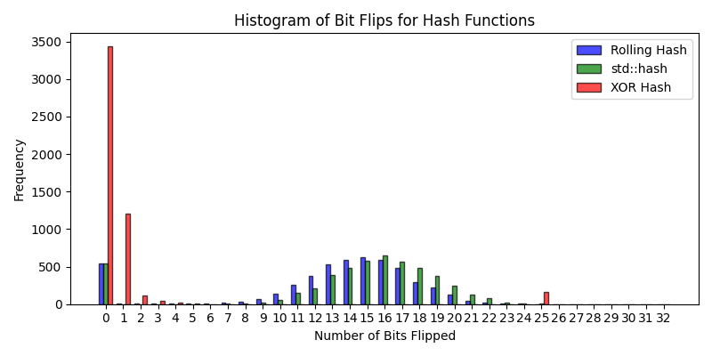
  <br />
  <em>Figure 1: No. of bits flipped on average by different hashing algorithms</em>
</p>

It is observed that among the given implementations, the std::hash performs best, with the rolling hash coming close.  
The nature of XOR hash and Random hash lead to poor performance on the avalanche test.  
XOR hash performs poorly particularly because for the given algorithm, one bit flip in the input, implies one bit flip in the output.  


<p>
  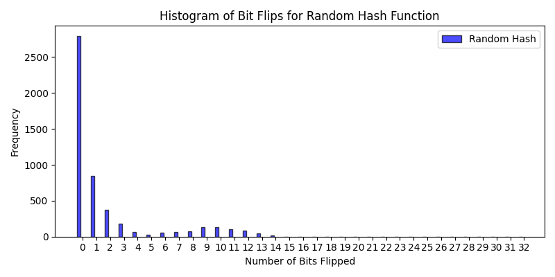
  <br />
  <em>Figure 2: No. of bits flipped on average by the random-hash algorithm</em>
</p>

Random-Hash performs poorly as flipping a bit only affects the output if that bit is among the chosen bits for the hasher (each bit chosen w.p. 50%).  
Additionally, this difference is amplified slightly by the distribution over modulo *m* (*m=999983*).

[report.hashing <-](#hashing-1)
<hr style="height:4px; background-color:black; border:none;" />


# [Range-Queries](#range-queries)

## Fenwick Trees (Binary Indexed Trees)
A Fenwick tree is an implicit tree where nodes are consecutively numbered, and parent-child relationships are determined by arithmetic on the node indexes.  
An important function in this index arithmetic is the least significant set bit. This is the greatest power of two which divides an index i {\displaystyle i}. This is the power of two (1, 2, 4, 8, ...) and not the exponent (0, 1, 2, 3, ...). It can be efficiently computed in two's complement arithmetic.  
- Precompute: $O(n)$ for an $n$ length array.
- Query: $O(log(n))$

## Segment Trees
A Segment Tree is a data structure that stores information about array intervals as a tree. This allows answering range queries over an array efficiently, while still being flexible enough to allow quick modification of the array.  
We explore one bottom-up and one top-down implementation.
- Precompute: $O(n)$ for an $n$ length array.
- Query: $O(log(n))$

## Results
Refer [benchmarks](#range-queries-benchmarks)

[report <-](#project-report)
<hr style="height:4px; background-color:black; border:none;" />

# [Range Queries' Benchmarks](#results-1)

Each size below is tested with 10 test instances per algorithm.  
**Array length, query count for test categories:**

- **Small-1** 10-100, 10-100
- **Small-2** 10-100, 100-1,000
- **Medium-1:** 1,000-10,000, 1,000-10,000
- **Medium-2:** 1,000-10,000, 10,000-100,000
- **Large:** 100,000-1,000,000, 100,000-1,000,000  
Queries are split evenly among update/sum queries.

## Range Queries' Results
Least and highest running times across all tests.  
|           | **fenwickTree**         | **segmentTree**         | **iterativeSegmentTree**|
|-----------|-------------------------|-------------------------|-------------------------|
| small-1   | (1,255, 3,454)          | (3,853, 10,065)         | (1,205, 4,383)          |
| small-2   | (2,357, 16,172)         | (6,359, 49,646)         | (3,123, 21,445)         |
| medium-1  | (29,236, 161,666)       | (126,403, 844,780)      | (44,588, 313,366)       |
| medium-2  | (430,298, 1,735,205)    | (2,341,528, 10,133,545) | (843,497, 3,598,143)    |
| large     | (8,258,384, 25,595,156) |(38,811,311, 173,135,398)| (11,716,570, 54,932,104)|
<div style="display: flex; gap: 20px;">
  <div>
    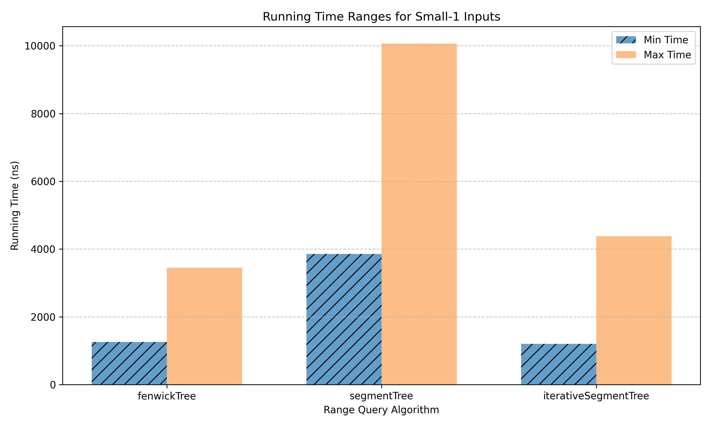
    <br />
    <em>Figure 1: Least and highest execution time on small inputs with few queries</em>
  </div>

  <div>
    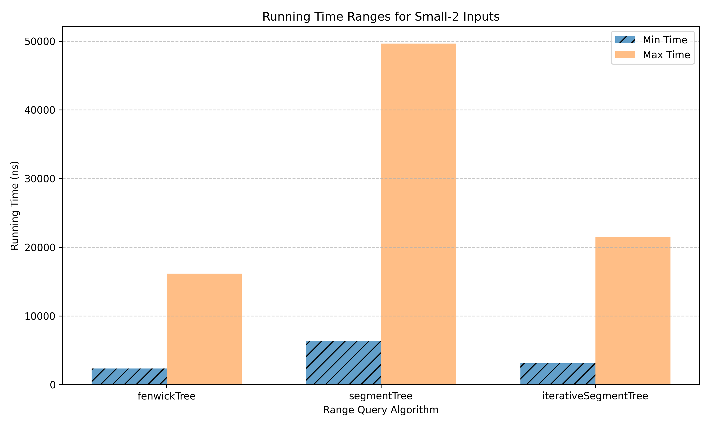
    <br />
    <em>Figure 2: Least and highest execution time on small inputs with many queries</em>
  </div>
</div>

<div style="display: flex; gap: 20px;">
<div>
  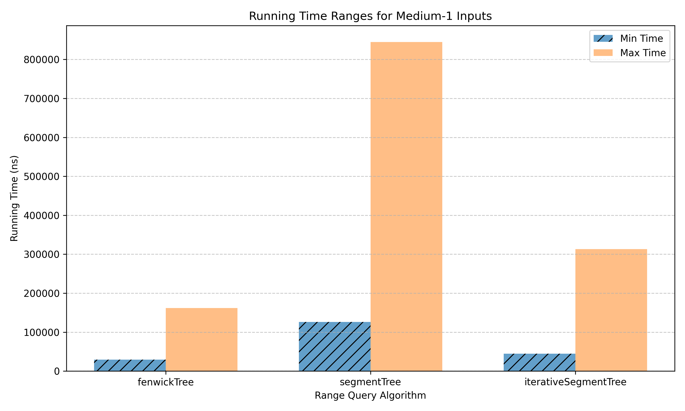
  <br />
  <em>Figure 3: Least and highest execution time on medium inputs with few queries</em>
</div>

<div>
  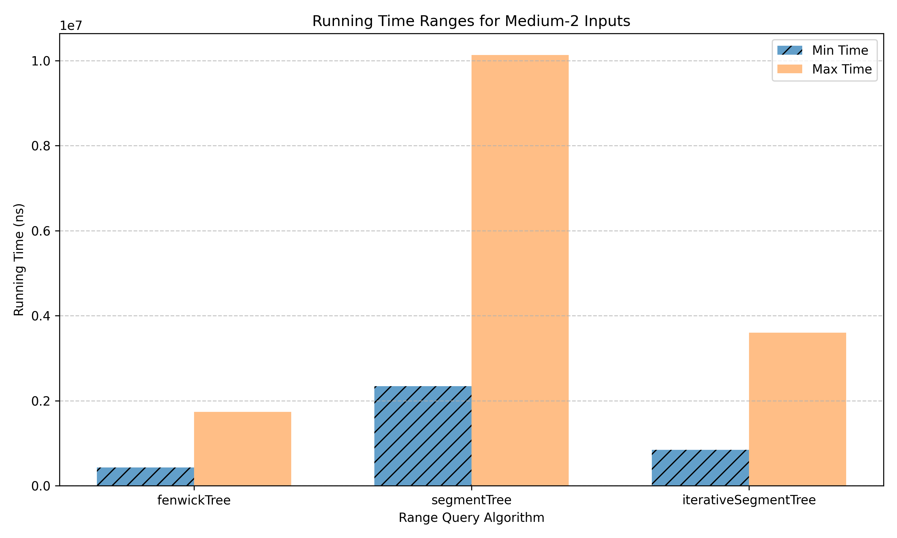
  <br />
  <em>Figure 4: Least and highest execution time on medium inputs with many queries</em>
</div>
</div>

<p>
  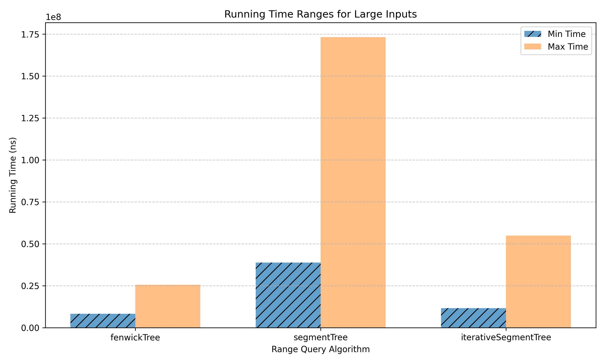
  <br />
  <em>Figure 5: Least and highest execution time on large inputs</em>
</p>

It is observed that across array sizes and query counts, fenwick trees typically perform best among the three, with the iterative version of segment tree following it closely, and the recursive segment tree lagging behind.  
In practice, the versatility of segment trees brings them to use above fenwick trees. For instance, even to handle range minimum queries, the standard fenwick trees fail, and we must use two in conjunction.


[report.range-queries <-](#range-queries-1)
<hr style="height:4px; background-color:black; border:none;" />

# [Sorting](#sorting)

## Insertion Sort
Standard insertion sort with $O(n^2)$ running time for an $n$ length array.
```pseudocode
i ← 1
while i < length(A)
    j ← i
    while j > 0 and A[j-1] > A[j]
        swap A[j] and A[j-1]
        j ← j - 1
    end while
    i ← i + 1
end while
```

## Merge Sort
Standard merge sort with $O(n*log(n))$ running time for an $n$ length array.
```pseudocode
algorithm merge_sort(list m) is
    if length of m ≤ 1 then
        return m

    var left := empty list
    var right := empty list
    for each x with index i in m do
        if i < (length of m)/2 then
            add x to left
        else
            add x to right

    left := merge_sort(left)
    right := merge_sort(right)

    return merge(left, right)
```

```pseudocode
algorithm merge(left, right) is
    var result := empty list

    while left is not empty and right is not empty do
        if first(left) ≤ first(right) then
            append first(left) to result
            left := rest(left)
        else
            append first(right) to result
            right := rest(right)

    while left is not empty do
        append first(left) to result
        left := rest(left)

    while right is not empty do
        append first(right) to result
        right := rest(right)

    return result
```

## QuickSort
Standard quick sort using random-pivot with worst case $O(n^2)$ and average case $O(n*log(n))$ running time for an $n$ length array.
```pseudocode
algorithm quicksort(A, lo, hi) is 
  if lo >= hi || lo < 0 then 
    return

  p := partition(A, lo, hi) 

  quicksort(A, lo, p - 1)
  quicksort(A, p + 1, hi)
```

```pseudocode
algorithm partition(A, lo, hi) is 
  pivot_idx = random(lo, hi)
  swap A[pivot_idx] and A[hi]
  pivot := A[hi]
  i := lo

  for j := lo to hi - 1 do 
    if A[j] <= pivot then 
      swap A[i] with A[j]
      i := i + 1

  swap A[i] with A[hi]
  return i
```

## Hybrid Sort
While a variety of hybrid sorting algorithms exist, we study a mix of quicksort and insertion sort for its practical efficiency.  
A mix of the quick-sort above and insertion sort, with $INSERTION\_SORT\_THRESHOLD = 65$.  
A subarray $s$ of length $slen$ is sorted using insertion sort if $slen \leq INSERTION\_SORT\_THRESHOLD$.  
Otherwise, the mechanics of quick sort as above are applied.  
Algorithm runs with worst case $O(n^2)$ and average case $O(n*log(n))$ running time for an $n$ length array.  
Faster in practice considering the practical improvements through insertion sort's efficiency over small subarrays.  
Other noteworthy hybrids:
- MergeSort + Insertion Sort  
Same as above, applying insertion sort on small subarrays.  
An interesting variant of the same can be found under [Timsort](https://en.wikipedia.org/wiki/Timsort).  
- QuickSort + HeapSort  
This algorithm applies quicksort till a recursive-depth of $O(log(n))$ for an $n$ length array, and switches to heapsort thereafter if still unsorted.  
Doing so allows the algorithm to guarantee worst case $O(n*log(n))$ running time while benefitting from general efficiency of quicksort.

## Results
Refer [benchmarks](#sorting-benchmarks)

[report <-](#project-report)
<hr style="height:4px; background-color:black; border:none;" />

# [Sorting Benchmarks](#results-2)

Each size below is tested with 10 test instances per algorithm.  
**Array lengths for test categories:**

- **Small:** 10–200
- **Medium:** 1,000–20,000
- **Large:** 100,000–2,000,000

## Sorting Results
Least and highest running times across all tests.  
|           | **insertionSort**       | **quickSort**           | **mergeSort**           | **hybridSort**          |
|-----------|-------------------------|-------------------------|-------------------------|-------------------------|
| small     | (709, 7,473)            | (768, 6,078)            |(933, 7,776)             | (763, 6,022)            |
| medium    | (141,312, 10,548,489)   | (81,225, 880,327)       |(94,431, 1,043,705)      | (72,792, 769,667)       |
| large     | (NA, NA)                | (9,733,001, 98,435,984) |(11,691,272, 120,194,603)| (8,779,871, 90,966,402) |

<p>
  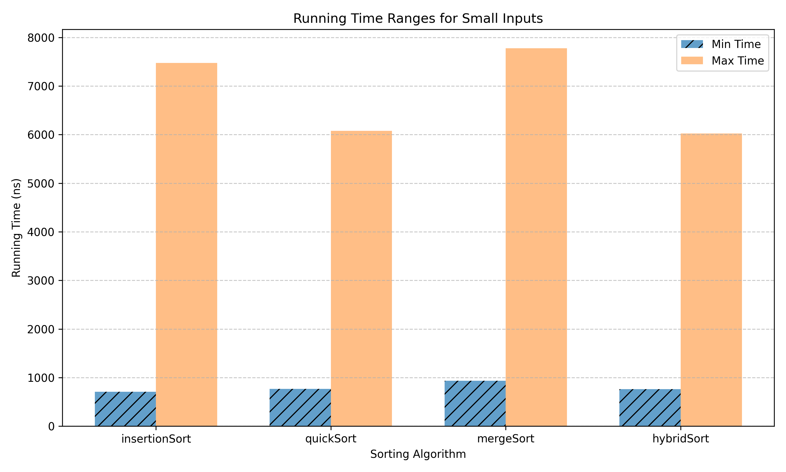
  <br />
  <em>Figure 1: Least and highest execution time for sorting algorithms on small sized inputs</em>
</p>

<p>
  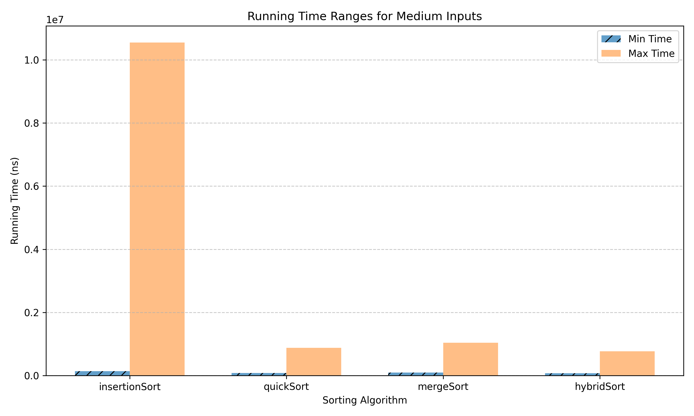
  <br />
  <em>Figure 2: Least and highest execution time for sorting algorithms on medium sized inputs</em>
</p>

<p>
  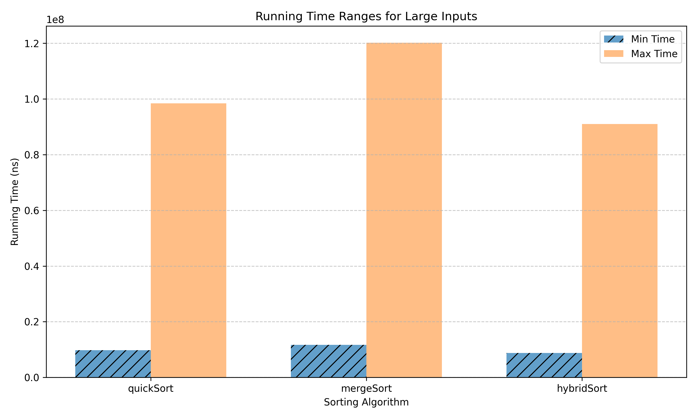
  <br />
  <em>Figure 3: Least and highest execution time for sorting algorithms on large sized inputs</em>
</p>

It is observed that for small inputs, InsertionSort is typically fast in practice, by virtue of its reliance on the same, HybridSort performs similarly, QuickSort lags behind a little and MergeSort is slightly slower still.  
In comparison, for medium to large sized inputs, InsertionSort expectedly blows up (since it is quadratic in time complexity) and HybridSort performs best, QuickSort lags behind a little and MergeSort is slightly slower still.

[report.sorting <-](#sorting-1)
<hr style="height:4px; background-color:black; border:none;" />


# [Strings](#strings)

## KMP
The KMP algorithm, named after Knuth, Morris, and Pratt, is an efficient implementation of the prefix function.  
Given a string *s*, of length *n*, the prefix function is defined as an array *p* of length *n*, where *p[i]* is the length of the longest proper prefix of the substring *s[0..i]* which is also a suffix of this substring.  
A proper prefix of a string is a prefix that is not equal to the string itself. By definition, *p[0] = 0*.  
Mathematically, *p[i]* = *max{k : s[0..k-1] = s[i - (k - 1)..i]}*, *k = 0..i*  
While a trivial implementation runs in *O(n<sup>2</sup>)* time, KMP runs in *O(n)* time.  

### Applications
- Search for a substring in a string
- Counting the number of occurrences of each prefix
- Compressing a string - representing a string *s* as *t+..+t* for some prefix *t* with the shortest length.

## Manacher
Manacher's algorithm provides an efficient way to find all sub-palindromes in a string *s* of length *n* in *O(n)* time.  
Formally, given a string *s* with length *n*, it finds all the pairs *(i, j)* such that substring *s[i..j]*  is a palindrome.  

### Applications
- Find largest subpalindrome
- Count no. of subpalindromes

## Rabin-Karp
Based on the idea of hashing, the Rabin-Karp algorithm compares the hash of substrings of a text *t* to that of a pattern *p*.  
The efficient implementation assumes that a matching hash implies (with high confidence) that the substring matches the pattern.  
In practice, results from [tests](tests) agree that the algorithm rarely fails (with good hash functions).  
It did not fail over a single instance among **100+** test runs.

### Applications
- Search for a substring in a string
- Counting the number of different substrings

## Z-Function
The Z-function calculates for each *i*, the greatest number of characters starting from the position *i* that coincide with the first characters of *s*.  
In other words, *z[i]* is the length of the longest string that is, at the same time, a prefix of *s* and a prefix of the suffix of *s* starting at *i*.  

### Applications
- Search for a substring in a string
- Counting the number of occurrences of each prefix
- Compressing a string - representing a string *s* as *t+..+t* for some prefix *t* with the shortest length.

## Results
Refer [benchmarks](#strings-benchmarks)

[report <-](#project-report)
<hr style="height:4px; background-color:black; border:none;" />

# [Strings' Benchmarks](#results-3)

Each size below is tested with 100 test instances per algorithm.  
**String lengths for test categories:**

- **Small:** 200–400  
- **Medium:** 2,000–4,000  
- **Large:** 20,000–40,000  
- **Huge:** 200,000–400,000  

---

## Pattern Matching Results
Least and highest running times across all tests.  
| **Size**  | **Rabin Karp**           | **KMP**                   | **Z-Function**            |
|-----------|--------------------------|---------------------------|---------------------------|
| Small     | (1,636, 45,676)          | (601, 4,348)              | (657, 5,191)              |
| Medium    | (13,937, 102,892)        | (2,548, 23,085)           | (3,598, 25,824)           |
| Large     | (148,434, 764,632)       | (24,126, 206,257)         | (37,017, 225,779)         |
| Huge      | (1,557,756, 4,086,762)   | (244,870, 1,547,581)      | (324,337, 1,749,875)      |

<p>
  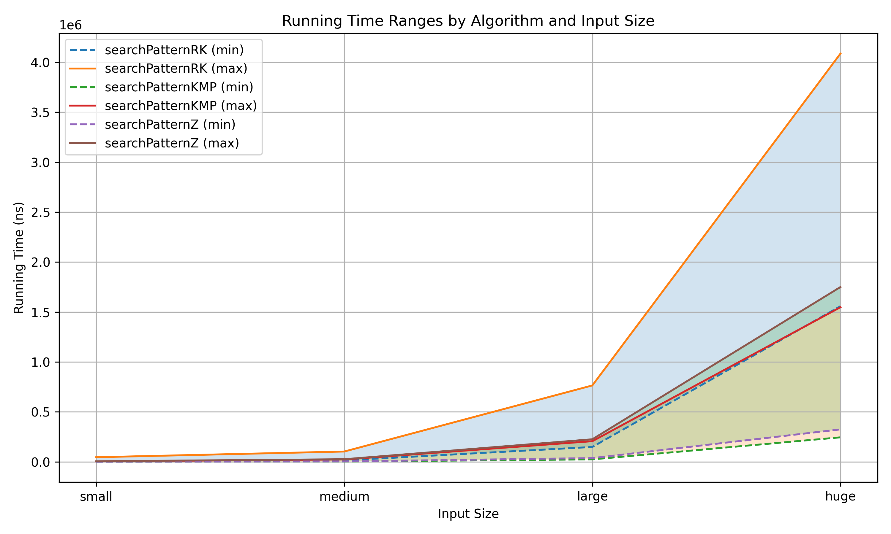
  <br />
  <em>Figure 1: Least and highest execution time for pattern matching algorithms</em>
</p>

It is observed that among the given implementations, KMP is the fastest with Z-Function slightly behind and Rabin-Karp being much slower.

---

## Subpalindrome Detection Results
Least and highest running times across all tests.  
| **Size**  | **Hashing+Binary Search** | **Manacher**                 |
|-----------|---------------------------|------------------------------|
| Small     | (13,785, 84,621)          | (3,518, 20,550)              |
| Medium    | (174,540, 983,490)        | (30,515, 161,428)            |
| Large     | (2,382,988, 5,553,449)    | (389,525, 1,050,119)         |
| Huge      | (28,819,973, 67,110,623)  | (3,411,973, 10,409,500)      |

<p>
  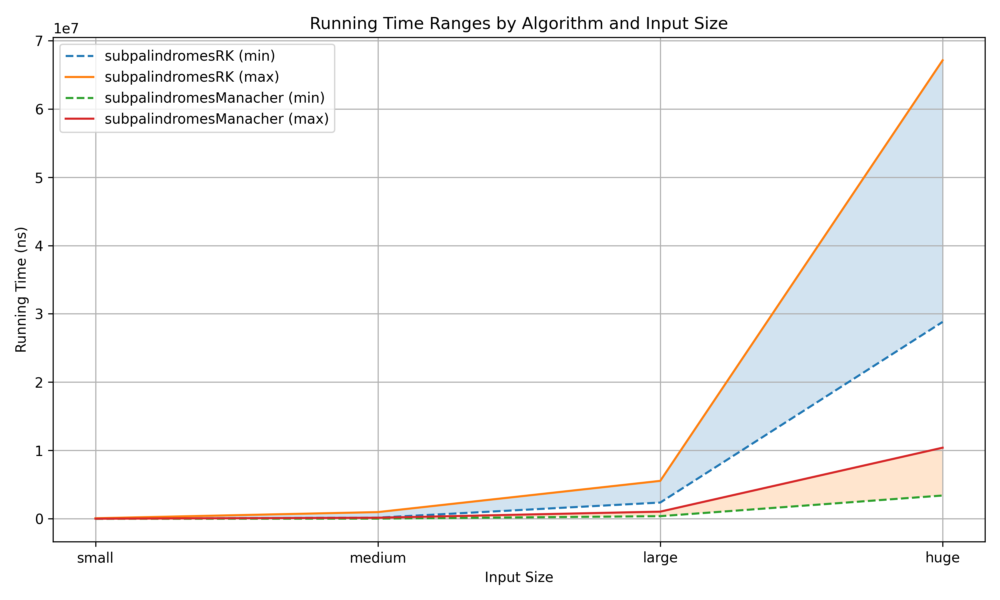
  <br />
  <em>Figure 2: Least and highest execution time for subpalindrome algorithms</em>
</p>

It is observed that among the given implementations, Manacher's Algoirthm is much faster, this agrees with the theoretical time complexity.  
Manacher's takes *O(n)* against the alternative of *O(n\*log(n))*.

[report.strings <-](#strings-1)
<hr style="height:4px; background-color:black; border:none;" />

# [Additional Algorithms](#additional-algorithms)

## Sparse Tables
Sparse Table is a data structure, that allows answering static range queries.  
The idea is to store for each range $[i:i + 2^j - 1]$, its result. This can be done efficiently using $O(n*log(n))$ memory and time precomputation.  
- Precompute: $O(n)$ for an $n$ length array.
- Query: $O(log(n))$ or $O(1)$ for [idempotent functions](https://en.wikipedia.org/wiki/Idempotence)

## Square Root Decomposition
Consider the problam of range updates and queries over an array of length $n$.  
Let us break the array into $`ceil(n/k)`$ blocks of length $k$ each.  
Maintain a range aggregate for each block.  
Doing so, allows us to performa an update/query in $O(n/k + k)$ time, going over block aggregates and a few extraneous elements to the right/left.  
Setting $k = n^{0.5}$, we can perform both, queries, and, updates in $O(n^{0.5})$ time.

## Cartesian Tree
A Cartesian tree is a binary tree that follows the min-heap property. The root is the minimum element and the left/right children are built recursively over the left/right subarrays split.  
It can be constructed in $O(n)$ time using stacks.  
<p>
  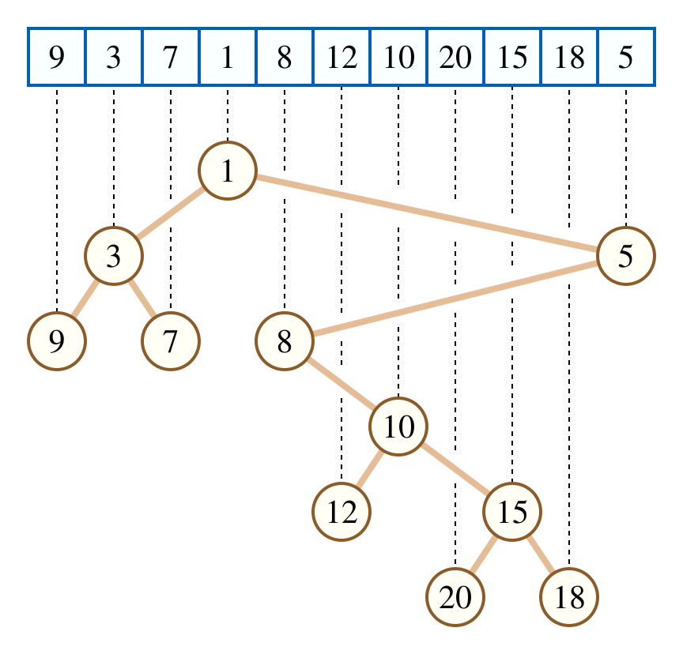
  <br />
  <em>Figure 1: An array and its Cartesian tree</em>
</p>

## Method of Four Russians
The Method of Four Russians is a technique for speeding up some algorithms over ranges. Particularly, when each cell may take on only a bounded number of possible values.  
- Break the problem of size *n* into subproblems of size *b*, plus some top-level problem of size *n / b*.
  - This is called a **macro/micro decomposition**.
- Solve all possible subproblems of size *b*.
- Solve the overall problem by combining solutions to the micro and macro problems.
- Think of it as **“divide, precompute, and conquer.”**  
Typically, $b = O(log(n))$. 

## Lowest Common Ancestor (LCA)
The lowest common ancestor problem involves efficiently finding the lowest common ancestor of any two nodes $v_1$ and $v_2$ in a tree, assuming no changes to the tree structure.  
Trivial algorithms can solve this in $O(n^2)$ time by solving for each pair and storing results.  
We shall look at other approaches of solving this efficiently.  
### Binary Lifting
Here, for each node, we store it's $2^j$ distance ancestor.  
Given that the $2^0$ ancestor is just the parent and the $2^{j+1}$ distance ancestor is the $2^j$ distance ancestor of the $2^j$ distance ancestor of the node, tranisitions are straightforward.  
This allows for $O(N*log(N))$ preprocessing for a tree with $N$ nodes.  
Further, each query can be answered in $O(log(N))$ time, as follows:
- Without loss of generality, let $height(v_1)$ = $u$ < $height(v_2)$ = $v$.
- Using at most $log(N)$ jumps, we can reach ancestor $v_2'$ from $v_2$, such that $height(v_2')$ = u.
- We then find the LCA of $v_1$ and $v_2'$, by finding the largest $2^j$ ancestor of each such that they differ, and repeat this until finially the parent of the two nodes found is common.  
- This node is the LCA.

### Farach-Colton and Bender
The algorithm borrows from the Method of Four Russians to break the [Eulerian tour](https://usaco.guide/gold/tree-euler?lang=cpp) of the tree array (of heights) into blocks.  
We divide the array  $A$  into blocks of size  $K = 0.5log(N)$. There are $ceil(N/K)$ blocks, for each block, store its aggregate, i.e., the minimum, and create a sparse table over these aggregates. The complexity to construct the sparse table is:  
<p>
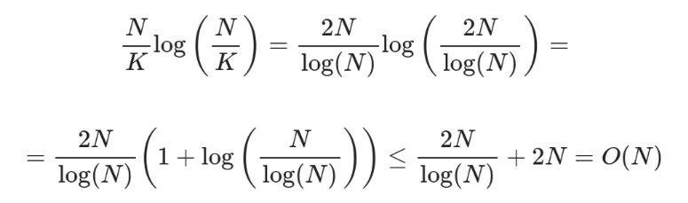
<br />
<em>Figure 1: Sparse Table Complexity</em>
</p>

Minimum over blocks can be solved using the above sparse table.  
For minimum within blocks, we observe that the values in the array being heights computed using the Euler tour of the tree, only differ by 1, i.e., $+1$ or $-1$, let us represent these by $0$, $1$ respectively.  
Consider subtracting from each element of a block, its first element, this does not change the result of queries (index of minima) inside the block.  
Because the blocks are so small, there are only a handful of possible sequences,  
<p>
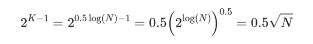
<br />
<em>Figure 2: Block Possibilities Count</em>
</p>

Thus, the number of different blocks is at most $O(N^{0.5})$, and therefore results of range minimum queries over them can be precomputed in $O(N^{0.5}*K^2)$ = $O(N^{0.5}*log^2(N))$ = $O(N)$ time. Mapping between blocks and results can be stored in an array $block[bitmask][left][right]$, storing the results of the block over its subarray $[left,right]$.

<br>

**Note:**  
An interesting implication of the above is a different method for the static range-minium-query (RMQ) problem.  
By constructing a cartesian tree on the input array (of length $n$), we can solve the RMQ problem with $O(n)$ precomputation and $O(1)$ time per query.  
Query resolution is equivalent here to finding the LCA over a range.

[report <-](#project-report)
<hr style="height:4px; background-color:black; border:none;" />


# [Docs](#project-report)

## Analysis
Algorithms' algorithmic complexity analysis and correctness guarantees where relevant are included.  

## Benchmarking
Real world performance of algorithms/programs depends on a variety of factors such as inputs, infrastructure capabilities, environment, program optimizations, etc.  
Theoretically optimal algorithms aren't necessarily the best solutions in practice. To understand and study these differences, we benchmark programs as follows:  
- Program running times may vary, and are considered to be random variables.
    - We would like to find statistical guarantees about the expected running times.
    - Since expectation and variance are unknown, concentration inequalities cannot be used to estimate tight bounds on expectation.
    - Considering the above, we instead study the n-th percentile performance with strict statistical guarantees.  
- Benchmarking Pipeline:  
    - Assuming program running times are random variables sampled from a distribution, the following ensues.
        - Run the program T times and note the running times, $t_1$, .., $t_n$.
        - Find the least and highest running times.  
        $lrt = \min_{1 \leq i \leq n} (t_i)$  
        $hrt = \max_{1 \leq i \leq n} (t_i)$  
        - *Claim:*  
            The median running time lies in the range [$lrt$, $hrt$] with probability $1$ - $2^{-(T - 1)}$.  
        - *Proof:*  
            Pr[$median \in [lrt, hrt]$] = $1$ - Pr[ $median < lrt$ | $hrt < median$]  
                                                        = $1$ - Pr[$median < lrt$] - Pr[$hrt < median$] (since the events are disjoint)  
                                                        = $1$ - $2^{-T}$ - $2^{-T}$  (since probability that a single execution is on either side = $2^{-1}$)  
                                                        = $1$ - $2^{-(T - 1)}$  
        - Similar arguments can be used to find $n^{th}$ percentile statistics.
- Comparing Algorithms  
    While exact comparisons between algorithms on the basis of the overlapping bounds are not feasible, a direct comparison can instead be made as follows:  
    - For each pair of algorithms, run both on the same set of inputs and compare running times.  
    - If either comes ahead by at least a margin (say, $5\%$), we can attribute that to the algorithm's efficiency.  
    - If not, the result for the same can be marked inconclusive.  

    While the above is more direct, we have used the bounds as indicative of performance and instead performed comparison across all algorithms rather than pairwise analysis.


## Optimizations
Unless stated otherwise, all benchmarked (C++) programs run with `Ofast`, `march=native` flags.

## References
- [GCC Optimization Pragmas](https://nor-blog.pages.dev/posts/2021-10-26-gcc-optimization-pragmas/)
- [Avalanche Effect](https://en.wikipedia.org/wiki/Avalanche_effect)
- [Polynomial Rolling Hash](https://cp-algorithms.com/string/rabin-karp.html)
- [FNV Hash](https://en.wikipedia.org/wiki/Fowler%E2%80%93Noll%E2%80%93Vo_hash_function)
- [Universal/Random-Hash](https://en.wikipedia.org/wiki/Universal_hashing)
- [Fenwick Tree, CP-Algorithms](https://cp-algorithms.com/data_structures/fenwick.html)
- [Segment Tree, CP-Algorithms](https://cp-algorithms.com/data_structures/segment_tree.html)
- [Iterative Segment Tree, Codeforces](https://codeforces.com/blog/entry/18051)
- [Fenwick Tree - Range Minimum Queries](https://ioinformatics.org/journal/v9_2015_39_44.pdf)
- [Insertion Sort, Wikipedia](https://en.wikipedia.org/wiki/Insertion_sort)
- [Merge Sort, Wikipedia](https://en.wikipedia.org/wiki/Merge_sort)
- [QuickSort, Wikipedia](https://en.wikipedia.org/wiki/Quicksort)
- [Dual Pivot Quicksort, JDK](https://github.com/openjdk/jdk/blob/master/src/java.base/share/classes/java/util/DualPivotQuicksort.java)
- [Dual Pivot Quicksort, Stack-Overlfow](https://stackoverflow.com/questions/20917617/whats-the-difference-of-dual-pivot-quick-sort-and-quick-sort)
- [KMP, CP-Algorithms](https://cp-algorithms.com/string/prefix-function.html)
- [Manacher, CP-Algorithms](https://cp-algorithms.com/string/manacher.html)
- [String-Hashing, CP-Algorithms](https://cp-algorithms.com/string/string-hashing.html)
- [Rabin-Karp, CP-Algorithms](https://cp-algorithms.com/string/rabin-karp.html)
- [Z-function, CP-Algorithms](https://cp-algorithms.com/string/z-function.html)
- [Sparse Table, CP-Algorithms](https://cp-algorithms.com/data_structures/sparse-table.html)
- [CS166-0, Wayback Machine](https://web.archive.org/web/20230812194808/http://web.stanford.edu/class/cs166/lectures/00/Small00.pdf)
- [CS166-1, Wayback Machine](https://web.archive.org/web/20240422013245/https://web.stanford.edu/class/cs166/lectures/01/Small01.pdf)
- [Method of Four Russians, Wikipedia](https://en.wikipedia.org/wiki/Method_of_Four_Russians)
- [Sqrt Decomposition, CP-Algorithms](https://cp-algorithms.com/data_structures/sqrt_decomposition.html)
- [LCA - Binary Lifting](https://cp-algorithms.com/graph/lca_binary_lifting.html)
- [LCA - Farach-Colton and Bender - CP-Algorithms](https://cp-algorithms.com/graph/lca_farachcoltonbender.html)
- [LCA - Range Minimum Query, CP-Algorithms](https://cp-algorithms.com/graph/rmq_linear.html)

[report <-](#project-report)
<hr style="height:4px; background-color:black; border:none;" />
