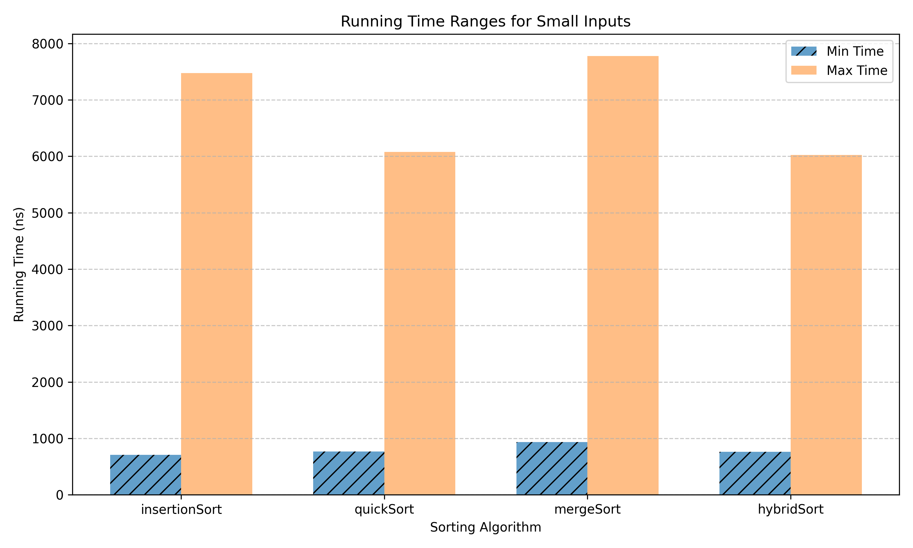
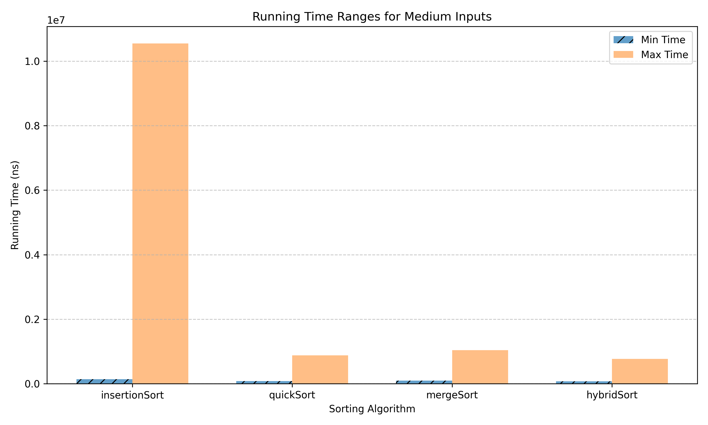
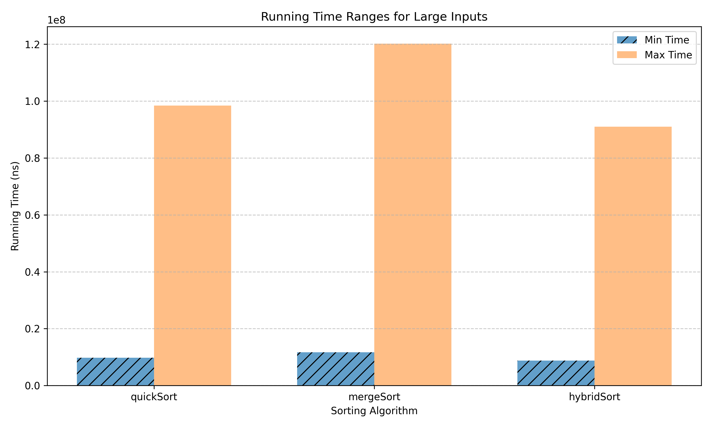

# Results

Each size below is tested with 10 test instances per algorithm.  
**Array lengths for test categories:**

- **Small:** 10–200
- **Medium:** 1,000–20,000
- **Large:** 100,000–2,000,000

## Sorting Results

|           | **insertionSort**       | **quickSort**           | **mergeSort**           | **hybridSort**          |
|-----------|-------------------------|-------------------------|-------------------------|-------------------------|
| small     | (709, 7473)             | (768, 6078)             | (933, 7776)             | (763, 6022)             |
| medium    | (141312, 10548489)      | (81225, 880327)         | (94431, 1043705)        | (72792, 769667)         |
| large     | (NA, NA)                | (9733001, 98435984)     | (11691272, 120194603)   | (8779871, 90966402)     |

  
   
  <em>Figure 1: Least and highest execution time for sorting algorithms on small sized inputs</em>

  
   
  <em>Figure 2: Least and highest execution time for sorting algorithms on medium sized inputs</em>

  
   
  <em>Figure 3: Least and highest execution time for sorting algorithms on large sized inputs</em>

It is observed that for small inputs, InsertionSort is typically fast in practice, by virtue of its reliance on the same, HybridSort performs similarly, QuickSort lags behind a little and MergeSort is slightly slower still.  
In comparison, for medium to large sized inputs, InsertionSort expectedly blows up (since it is quadratic in time complexity) and HybridSort performs best, QuickSort lags behind a little and MergeSort is slightly slower still.
