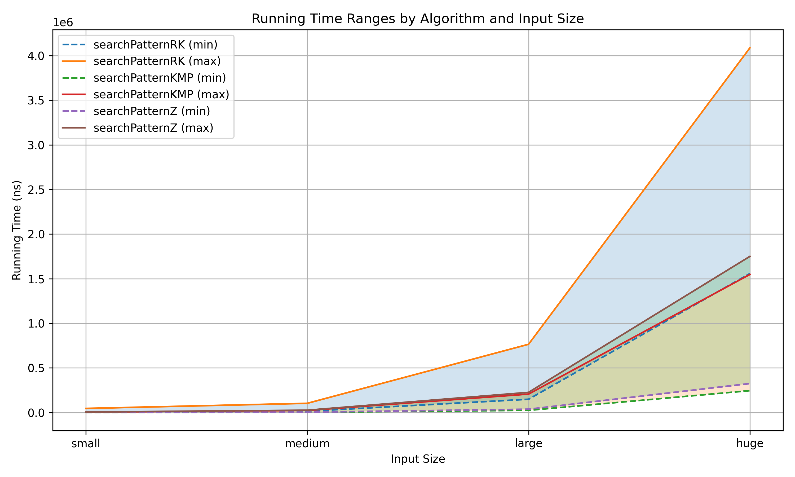
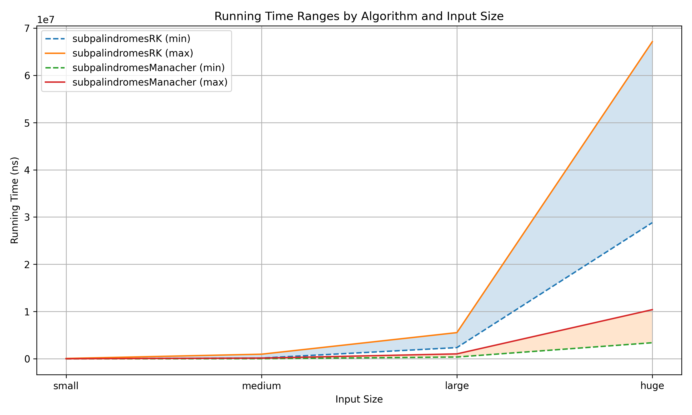

# Results

Each size below is tested with 100 test instances per algorithm.  
**String lengths for test categories:**

- **Small:** 200–400  
- **Medium:** 2,000–4,000  
- **Large:** 20,000–40,000  
- **Huge:** 200,000–400,000  

---

## Pattern Matching Results
Least and highest running times across all tests.  
| **Size**  | **Rabin Karp**           | **KMP**                   | **Z-Function**            |
|-----------|--------------------------|---------------------------|---------------------------|
| Small     | (1,636, 45,676)          | (601, 4,348)              | (657, 5,191)              |
| Medium    | (13,937, 102,892)        | (2,548, 23,085)           | (3,598, 25,824)           |
| Large     | (148,434, 764,632)       | (24,126, 206,257)         | (37,017, 225,779)         |
| Huge      | (1,557,756, 4,086,762)   | (244,870, 1,547,581)      | (324,337, 1,749,875)      |

  
   
  <em>Figure 1: Least and highest execution time for pattern matching algorithms</em>

It is observed that among the given implementations, KMP is the fastest with Z-Function slightly behind and Rabin-Karp being much slower.

---

## Subpalindrome Detection Results
Least and highest running times across all tests.  
| **Size**  | **Hashing+Binary Search** | **Manacher**                 |
|-----------|---------------------------|------------------------------|
| Small     | (13,785, 84,621)          | (3,518, 20,550)              |
| Medium    | (174,540, 983,490)        | (30,515, 161,428)            |
| Large     | (2,382,988, 5,553,449)    | (389,525, 1,050,119)         |
| Huge      | (28,819,973, 67,110,623)  | (3,411,973, 10,409,500)      |

  
   
  <em>Figure 2: Least and highest execution time for subpalindrome algorithms</em>

It is observed that among the given implementations, Manacher's Algoirthm is much faster, this agrees with the theoretical time complexity.  
Manacher's takes *O(n)* against the alternative of *O(n\*log(n))*.